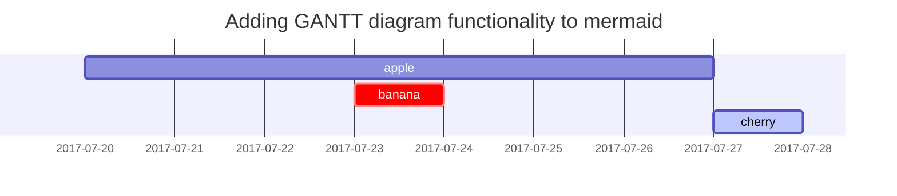

本章我们将开始讨论深度学习，深度学习可以用于提取非结构化数据的判别特征。

## 13.1 引言

在部分 $\mathrm{II}$， 我们讨论了在回归和分类任务中的线性模型。其中，在第$\textrm{11}$章，我们讨论了线性回归模型，即 $p(y|\mathbf{x}, \mathbf{w})=\mathcal{N}\left(y|\mathbf{w}^{\top}\mathbf{x}, \sigma^{2}\right)$  。在第$\textrm{10}$章，我们讨论了逻辑回归，在二分类任务中，模型定义为 $p(y|\mathbf{x}, \mathbf{w})={\rm{Ber}}(y|\sigma(\mathbf{w}^{\top}\mathbf{x}))$，在多分类任务中，模型定义为 $ p(y|\mathbf{x},\mathbf{w})=\operatorname{Cat}(y|\mathcal{S}(\mathbf{W} \mathbf{x}))$。在第$\textrm{12}$章，我们讨论了广义线性模型，定义为:
$$
p(\mathbf{y}|\mathbf{x};\pmb{\theta})=p(\mathbf{y}|g^{-1}(f(\mathbf{x};\pmb{\theta}))) \tag{13.1}
$$
其中 $p(\mathbf{y}|\pmb{\mu})$ 表示均值为 $\pmb{\mu}$ 的指数族分布，$g^{-1}()$ 表示该指数族分布对应的逆连接函数。上式中:
$$
f(\mathbf{x};\pmb{\theta})=\mathbf{Wx} + \mathbf{b} \tag{13.2}
$$
表示关于输入的一个线性（仿射）变换函数， 其中 $\mathbf{W}$ 被称为 **权重** ($\textrm{weights}$)，$\mathbf{b}$ 被称为 **偏置** ($\textrm{biases}$)。

------

线性模型中的线性关系假设具有很强的局限性。为了增加此类线性模型的灵活性，一种简单方法是使用特征变换，即利用 $\phi(\mathbf{x})$ 替代 $\mathbf{x}$。举例来说，我们可以使用多项式变换，在 $\textrm{1}$ 维数据中，该变换函数定义为 $\phi(x)=[1,x,x^2,x^3,...]$，我们在 $\textrm{1.2.2.2}$ 节中对该方法进行了讨论。这种方法有时被称为 **基函数拓展** ($\textrm{basis function expansion}$)。基于该变换，上述模型定义为:
$$
f(\mathbf{x}; \pmb{\theta})=\mathbf{W}\mathbf{\phi}(\mathbf{x}) + \mathbf{b} \tag{13.3}
$$
上式关于参数 $\pmb{\theta}=(\mathbf{W}, \mathbf{b})$ 依然是线性关系，从而降低了模型的拟合难度。然而，手动设计的特征变换函数依然具有很强的局限性。

一个很自然的拓展是为特征提取器赋予自己的参数 $\pmb{\theta}^\prime$， 即:
$$
f(\mathbf{x};\pmb{\theta},\pmb{\theta}^\prime)=\mathbf{W}\phi(\mathbf{x};\pmb{\theta}^\prime)+\mathbf{b} \tag{13.4}
$$
我们可以递归地重复上述过程，从而构造一个越来越复杂的函数。如果我们组合 $L$ 个函数，即
$$
f(\mathbf{x};\pmb{\theta})=f_L(f_{L-1}(...(f_1(\mathbf{x}))...)) \label{eq:13.5} \tag{13.5}
$$
其中 $f_l(\mathbf{x})=f(\mathbf{x};\pmb{\theta}_l)$ 为第 $l$ 层的函数。这便是 **深度神经网络** ($\textrm{deep neural networks, DNNs}$) 背后的关键思想。

> 特征变换： feature transformation
>
> 特征提取器： feature extractor

------

术语 “$\textrm{ DNN}$ ” 实际上包含了一系列模型，其中我们将可微函数组合到任何类型的 $\textrm{DAG}$（有向无环图）中，实现输入到输出的映射函数建模。 式 (\ref{eq:13.5}) 是链式 $\textrm{DAG}$ 的最简单示例。 这被称为 **前馈神经网络**（$\textrm{feedforward neural network, FFNN}$）或 **多层感知器**（$\textrm{multilayer perceptron, MLP}$）。

$\textrm{MLP}$ 假定输入是一个维度固定的矢量，即 $\mathbf{x} \in \mathbb{R}^D$。 我们称此类数据为“**非结构化数据**” ($\textrm{unstructured data}$)，因为我们没有对输入的形式进行任何假设。 但是，这使得该模型难以应用于具有可变大小或形状的输入。 在第 $\textrm{14}$ 章中，我们讨论了**卷积神经网络**（$\textrm{convolutional neural networks, CNN}$），用于处理可变大小的图像。 在第 $\textrm{15}$ 章中，我们讨论了**递归神经网络**（$\textrm{recurrent neural networks, RNN}$），用于处理可变大小的序列。 在第 $\textrm{23}$ 章中，我们讨论了**图神经网络**（$\textrm{graph neural networks, GNN}$），用于处理可变大小的图。 有关 $\textrm{DNN}$ 的更多信息，请参见其他书籍，例如 [HG20][^HG20], [Zha19a][^Zha19a], [Ger19][^Ger19]。

[^HG20]: J. Howard and S. Gugger. Deep Learning for Coders with Fastai and PyTorch: AI Applications Without a PhD. en. 1st ed. O’Reilly Media, Aug. 2020.
[^Zha19a]: A. Zhang, Z. Lipton, M. Li, and A. Smola. Dive into deep learning. 2019.
[^Ger19]: A. Géron. Hands-On Machine Learning with Scikit-Learn and TensorFlow: Concepts, Tools, and Techniques for Building Intelligent Systems (2nd edition). en. O’Reilly Media, Incorporated, 2019.

## 13.2 多层感知机

在第 $\textrm{10.2.5}$ 节，我们表明 **感知机** ($\textrm{perceptron}$) 就是逻辑回归模型的一个确定性版本。具体来说，它是一个具备如下形式映射函数:
$$
f(\mathbf{x};\mathbf{\theta})=\mathbb{I}(\mathbf{w}^{\rm{T}}\mathbf{x}+b\ge0)=H(\mathbf{w}^{\rm{T}}\mathbf{x}+b) \tag{13.6}
$$
其中 $H(a)$ 表示 **单位阶跃函数**（$\textrm{heaviside step function}$）， 又被称为 **线性阈值函数** ($\textrm{linear threshold function}$）。由于感知机的决策边界依然是线性的，所以其表达能力十分有限。$\textrm{1969}$ 年，$\textrm{Marvin Minsky}$ 和 $\textrm{Seymour Papert}$ 出版了一本名为 $\textrm{《 Perceptrons》}$ [MP69][^MP69] 的著名著作，其中他们给出了许多感知机无法解决的模式识别的问题。 在讨论如何解决问题之前，我们首先举一个具体的例子。

``` M. Minsky and S. Papert. Perceptrons. MIT Press, 1969.``` 


| $x_1$ | $x_2$ | $y$  |
| ----- | ----- | :--: |
| 0     | 0     |  0   |
| 0     | 1     |  1   |
| 1     | 0     |  1   |
| 1     | 1     |  0   |

表$\textrm{ 13.1}$： 抑或问题的真值表，$y=x_{1} \underline{\vee} x_{2}$。


图 $\textrm{13.1}$：$\textrm{(a)}$ 抑或函数无法实现线性可分，但基于单位阶跃函数构建的两层模型可以将数据分开。程序由 $xor-heaviside.py$ 生成。 $\textrm{(b)}$ 包含一个隐藏层的神经网络，其中的权重由人工设计，该网络实现了抑或函数。 $h_1$ 表示 $AND$ 函数，$h_2$ 表示 $OR$ 函数。 偏置项表示为常数节点（值为 $\textrm{1}$）的连接权重。

```python
import numpy as np
# Show that 2 layer MLP (with manually chosen weights) can solve the XOR problem
# xor-heaviside.py
import numpy as np
import matplotlib.pyplot as plt
def heaviside(z):
    return (z >= 0).astype(z.dtype)
def mlp_xor(x1, x2, activation=heaviside):
    return activation(-activation(x1 + x2 - 1.5) + activation(x1 + x2 - 0.5) - 0.5)
x1s = np.linspace(-0.2, 1.2, 100)
x2s = np.linspace(-0.2, 1.2, 100)
x1, x2 = np.meshgrid(x1s, x2s)

z1 = mlp_xor(x1, x2, activation=heaviside)
z2 = mlp_xor(x1, x2, activation=sigmoid)

plt.figure()
plt.contourf(x1, x2, z1)
plt.plot([0, 1], [0, 1], "gs", markersize=20)
plt.plot([0, 1], [1, 0], "r^", markersize=20)
plt.title("Activation function: heaviside", fontsize=14)
plt.grid(True)
plt.show()
```


### 13.2.1 抑或问题

$\textrm{《 Perceptrons》}$书中最著名的例子之一就是 $\textrm{XOR}$ 问题。 这里的目标是学习一个计算两个二进制输入的异或函数。 表 $\textrm{13.1}$ 给出了该函数的真值表。 我们在图 $\textrm{13.1a}$ 中对该函数进行了可视化。 显然，数据不是线性可分离的，因此感知机模型无法表示该映射函数。

但是，我们可以通过叠加多个感知机来克服这个问题。 这称为**多层感知机**（$\textrm{multilayer perceptron, MLP}$）。 例如，要解决 $\textrm{XOR}$ 问题，我们可以使用图$\textrm{13.1b}$ 所示的 $\textrm{MLP}$。 它由 $\textrm{3}$ 个感知机组成，分别表示为 $h_1$，$h_2$ 和 $y$。 节点 $x$ 表示输入，节点 $1$ 表示常数项。 节点 $h_1$ 和 $h_2$ 被称为**隐藏单元** （$\textrm{hidden units}$），因为在训练数据中未观察到它们的真值。

第一个隐藏单元通过使用设置的合理权重来计算 $h_{1}=x_{1} \wedge x_{2}$。（此处 $\wedge$ 表示 $\rm{AND}$ 操作。）特别地，它的输入为 $x_1$和 $x_2$，且权重均为为 $\textrm{1.0}$，同时具有 $\textrm{-1.5}$ 的偏置项（通过虚拟一个常量节点 $\textrm{1}$ 来实现偏置）。 因此，如果 $x_1$ 和 $x_2$ 都等于 $\textrm{1}$，则 $h_1$ 将被激活，因为
$$
\mathbf{w}_1^{\rm{T}}\mathbf{x}-b_1=[1.0, 1.0]^{\rm{T}}[1, 1] - 1.5 =0.5 > 0 \tag{13.7}
$$
类似的，第二个隐藏单元计算 $h_{2}=x_{1} \vee x_{2}$，其中 $\vee$ 为 $\rm{OR}$ 操作，第三个节点计算输出 $y=\overline{h_1} \wedge h_2$，其中 $\bar{h}=\neg h$ 为 $\rm{NOT}$ 操作 （ 逻辑非）。 所以节点 $y$ 计算
$$
y=f\left(x_{1}, x_{2}\right)=\overline{\left(x_{1} \wedge x_{2}\right)} \wedge\left(x_{1} \vee x_{2}\right) \tag{13.8}
$$
上式等价于 $\rm{XOR}$ 函数。

通过扩展上述示例，我们可以证明 $\textrm{MLP}$ 可以表示任何逻辑函数。 但是，我们显然希望避免手动指定权重和偏差。 在本章的其余部分，我们将讨论从数据中学习这些参数的方法。

### 13.2.2 可微多层感知机

我们在第 $\textrm{13.2.1}$ 节中讨论的 $\textrm{MLP}$ 被定义为多个感知机的叠加，每个感知机都包含不可微的 $\textrm{Heaviside}$ 函数。 这使得这种模型很难训练，这就是为什么它们从未被广泛使用的原因。然而，如果我们将阶跃函数 $H:\mathbb{R}\rightarrow \{0,1\}$ 替换为一个可微的 **激活函数** （$\textrm{activation function}$）$\varphi:\mathbb{R} \rightarrow \mathbb{R}$ 。更精确地讲，我们将每一层 $l$ 的隐藏单元 $\mathbf{z}_l$ 定义为通过激活函数逐元素传递的上一层隐藏单元的线性变换：

> More precisely, we define the hidden units $\mathbf{z}_l$ at each layer $l$ to be a linear transformation of the hidden units at the previous layer passed elementwise through this activation function.


$$
\mathbf{z}_l=f_l(\mathbf{z}_{l-1})=\varphi(\mathbf{b}_l+\mathbf{W}_l\mathbf{z}_{l-1}) \tag{13.9}
$$


或者，以标量的形式：


$$
z_{kl}=\varphi_l \left( b_{kl}+\sum_{j=1}^{K_{l-1}}w_{jkl}z_{jl-1} \right) \tag{13.10}
$$

如式 (\ref{eq:13.5}) 中所示，如果我们现在将 $L$ 个诸如此类的激活函数叠加在一起。然后我们可以使用链式规则，计算输出关于每一层中的参数的梯度，也称为**反向传播** （$\textrm{backpropagation}$），如我们在第 $\textrm{13.3}$ 节中所解释的。 （这对于任何一种可微的激活函数都是正确的，尽管某些类型的函数要比其他类型的函数更适用，正如我们在第 $\textrm{13.2.3}$ 节中讨论的那样。）然后，我们可以将梯度传递给优化器，从而最小化某些训练目标，正如我们在 $\textrm{13.4}$ 节讨论的那样。 因此，术语“$\textrm{ MLP}$”几乎总是指可微的模型，而不是指具有不可微分线性阈值单位的历史版本。

> 不可微: non-differentiable


| $\textrm{Name}$                    | $\textrm{Definition}$                                        | $\textrm{Range}$     | $\textrm{Reference}$            |
| ---------------------------------- | ------------------------------------------------------------ | -------------------- | ------------------------------- |
| $\textrm{Sigmoid}$                 | $\sigma_{a}=\frac{1}{1+e^{-a}}$                              | $[0, 1]$             |                                 |
| $\textrm{Hyperbolic tangent}$      | $\tanh(a)=2\sigma(2a)-1$                                     | $[-1, 1]$            |                                 |
| $\textrm{Softplus}$                | $\sigma_{+}(a)=\log(1+e^a)$                                  | $[0, \infty]$        | [GBBB11][^GBB11]                |
| $\textrm{Rectified linear unit}$   | $\operatorname{ReLU}(a)=\max (a, 0)$                         | $[0, \infty]$        | [GBB11][^GBB11];[KSH12][^KSH12] |
| $\textrm{Leaky ReLU}$              | $\max (a, 0)+\alpha \min (a, 0)$                             | $[-\infty, +\infty]$ | [MHN13][^MHN13]                 |
| $\textrm{Exponential linear unit}$ | $\max (a, 0)+\min \left(\alpha\left(e^{a}-1\right), 0\right)$ | $[-\infty, +\infty]$ | [CUH16][^CUH16]                 |
| $\textrm{Swish}$                   | $a \sigma(a)$                                                | $[-\infty, +\infty]$ | [RZL17][^RZL17]                 |

表 $\textrm{13.2}$：神经网络中常用的一些激活函数

[^GBB11]: text
[^KSH12]: text
[^ MHN13]: text
[^ CUH16]: text
[^ RZL17]: text


图 $\textrm{13.2}$：$\textrm{(a)}$ 对于 $sigmoid$ 函数而言，当输入在 $0$ 附近时，输出与输入呈线性关系，但对于较大的正值或负值输入，则输出存在饱和区。图形由程序 生成。 $\textrm{(b)}$ 一些常用的非饱和激活函数的可视化。图形由程序 生成。

This post is to show Markdown syntax rendering on [**Chirpy**](https://github.com/cotes2020/jekyll-theme-chirpy/fork), you can also use it as an example of writing. Now, let's start looking at text and typography.


## Titles
---
# H1 - heading

<h2 data-toc-skip>H2 - heading</h2>
<h3 data-toc-skip>H3 - heading</h3>
<h4>H4 - heading</h4>
---
<br>

## Paragraph

I wandered lonely as a cloud

That floats on high o'er vales and hills,

When all at once I saw a crowd,

A host, of golden daffodils;

Beside the lake, beneath the trees,

Fluttering and dancing in the breeze.

## Lists

### Ordered list

1. Firstly
2. Secondly
3. Thirdly

### Unordered list

- Chapter
	- Setcion
      - Paragraph

### Task list

- [ ] TODO
- [x] Completed
- Hold on
- [ ] Defeat COVID-19
  - [x] Vaccine production
  - [ ] Economic recovery
  - [ ] People smile again

### Description list

Sun
: the star around which the earth orbits

Moon
: the natural satellite of the earth, visible by reflected light from the sun


## Block Quote

> This line to shows the Block Quote.

## Tables

| Company                      | Contact          | Country |
|:-----------------------------|:-----------------|--------:|
| Alfreds Futterkiste          | Maria Anders     | Germany |
| Island Trading               | Helen Bennett    | UK      |
| Magazzini Alimentari Riuniti | Giovanni Rovelli | Italy   |

## Links

<http://127.0.0.1:4000>


## Footnote

Click the hook will locate the footnote[^footnote], and here is another footnote[^fn-nth-2].


## Images

- Default (with caption)


_Full screen width and center alignment_

<br>

- Specify width

{: width="400"}
_400px image width_

<br>

- Left aligned

{: width="350" .normal}

<br>

- Float to left

  {: width="240" .left}
  "A repetitive and meaningless text is used to fill the space. A repetitive and meaningless text is used to fill the space. A repetitive and meaningless text is used to fill the space. A repetitive and meaningless text is used to fill the space. A repetitive and meaningless text is used to fill the space. A repetitive and meaningless text is used to fill the space. A repetitive and meaningless text is used to fill the space. A repetitive and meaningless text is used to fill the space. A repetitive and meaningless text is used to fill the space. A repetitive and meaningless text is used to fill the space. A repetitive and meaningless text is used to fill the space. A repetitive and meaningless text is used to fill the space."

<br>

- Float to right

  {: width="240" .right}
  "A repetitive and meaningless text is used to fill the space. A repetitive and meaningless text is used to fill the space. A repetitive and meaningless text is used to fill the space. A repetitive and meaningless text is used to fill the space. A repetitive and meaningless text is used to fill the space. A repetitive and meaningless text is used to fill the space. A repetitive and meaningless text is used to fill the space. A repetitive and meaningless text is used to fill the space. A repetitive and meaningless text is used to fill the space. A repetitive and meaningless text is used to fill the space. A repetitive and meaningless text is used to fill the space. A repetitive and meaningless text is used to fill the space."

<br>

## Mermaid SVG




## Mathematics

The mathematics powered by [**MathJax**](https://www.mathjax.org/):

$$ \sum_{n=1}^\infty 1/n^2 = \frac{\pi^2}{6} $$

When $a \ne 0$, there are two solutions to $ax^2 + bx + c = 0$ and they are

$$ x = {-b \pm \sqrt{b^2-4ac} \over 2a} $$


## Inline code

This is an example of `Inline Code`.


## Code block

### Common

```
This is a common code snippet, without syntax highlight and line number.
```

### Specific Languages

#### Console

```console
$ env |grep SHELL
SHELL=/usr/local/bin/bash
PYENV_SHELL=bash
```

#### Ruby

```ruby
def sum_eq_n?(arr, n)
  return true if arr.empty? && n == 0
  arr.product(arr).reject { |a,b| a == b }.any? { |a,b| a + b == n }
end
```

#### Shell

```shell
if [ $? -ne 0 ]; then
    echo "The command was not successful.";
    #do the needful / exit
fi;
```

#### Liquid


```liquid

  This product's title contains the word Pack.

```


#### Java

```java
private void writeObject(java.io.ObjectOutputStream s)
  throws java.io.IOException {
  // Write out any hidden serialization magic
  s.defaultWriteObject();
  for (E e: map.keySet()) s.writeObject(e);
}
```

## Reverse Footnote

[^footnote]: The footnote source
[^fn-nth-2]: The 2nd footnote source
